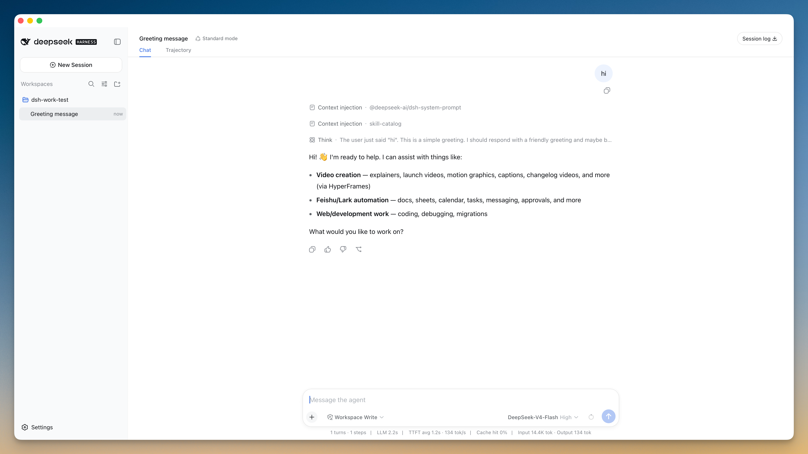
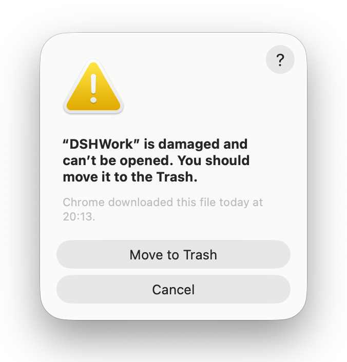

<div align="right">

[简体中文](README.md) | **English**

</div>

<div align="center">
  

  <p>
    <a href="https://github.com/shenjingnan/dsh-work/releases"></a>
    <a href="https://crates.io/crates/dsh-work"></a>
    <a href="https://github.com/shenjingnan/dsh-work/actions/workflows/ci.yml"></a>
    <br />
    <a href="LICENSE"></a>
    <a href="https://www.rust-lang.org/"></a>
    <a href="#download"></a>
    <a href="#download"></a>
    <a href="#download"></a>
  </p>
</div>

**DSHWork** (dsh-work) is the desktop app for [DeepSeek Harness](https://github.com/deepseek-ai/deepseek-harness) (dsh): download, install, double-click — no Node.js setup required.

> 🚧 This project is in early development.

<div align="center">
  
</div>

<details>

<summary>✨ Features</summary>

- **Batteries included** — the installer bundles a Node.js runtime and dsh itself; nothing else to install
- **Desktop app** — Tauri 2, single window embedding the dsh Web UI, for MacOS / Windows / Linux
- **Local first** — the dsh service runs on the loopback address; your data never leaves the device
- **Custom title bar** — frameless window with a per-platform custom header
- **CLI skeleton** — clap-based argument parsing with subcommands and shell completion generation
- **Async runtime** — tokio integrated, async/await out of the box
- **Configuration** — TOML config files with `${env.VAR}` environment variable references
- **Dual-layer logging** — tracing-based logs to both file and stderr

</details>

## Download

Click a button below to grab the latest installer for your system:

| System | Chip / Arch | Download |
| --- | --- | --- |
| Windows 10 / 11 | x64 | [](https://github.com/shenjingnan/dsh-work/releases/latest/download/DSHWork_Windows_x64.exe) |
| MacOS | Apple Silicon (M1/M2/M3/M4) | [](https://github.com/shenjingnan/dsh-work/releases/latest/download/DSHWork_macOS_arm64.dmg) |
| MacOS | Intel | [](https://github.com/shenjingnan/dsh-work/releases/latest/download/DSHWork_macOS_x64.dmg) |
| Ubuntu / Debian | amd64 | [](https://github.com/shenjingnan/dsh-work/releases/latest/download/DSHWork_Linux_amd64.deb) |
| Fedora / RHEL | x86_64 | [](https://github.com/shenjingnan/dsh-work/releases/latest/download/DSHWork_Linux_x86_64.rpm) |

- Windows: an [MSI installer](https://github.com/shenjingnan/dsh-work/releases/latest/download/DSHWork_Windows_x64.msi) is available for enterprise deployment; Linux: an [AppImage](https://github.com/shenjingnan/dsh-work/releases/latest/download/DSHWork_Linux_amd64.AppImage) build runs without installation.
- 🍎 Not sure which Mac chip? Apple menu → About This Mac: "Chip: Apple M…" → arm64; "Processor: Intel…" → x64. If the first launch says the app is damaged, see the fix below.
- Full version history and changelogs: [Releases](https://github.com/shenjingnan/dsh-work/releases).

### MacOS says "DSHWork is damaged and can't be opened"?

The app is not signed or notarized with Apple, so Gatekeeper blocks the first launch with ""DSHWork" is damaged and can't be opened. You should move it to the Trash." — **the app is not actually damaged**:

<div align="center">
  
</div>

Two ways to fix it (drag DSHWork into the Applications folder first):

- **Double-click the fixer script (recommended)**: open the downloaded DMG image and double-click 「首次打开修复.command」 inside — it fixes the issue and launches the app automatically;
- **Run the command manually**: open Terminal and run:

  ```bash
  xattr -cr /Applications/DSHWork.app
  ```

After that, DSHWork opens normally.

## Contributing

Issues and PRs are welcome! See [CONTRIBUTING.md](CONTRIBUTING.md) (in Chinese) for how the app works, local development, and the project layout.

## License

[MIT](LICENSE)
