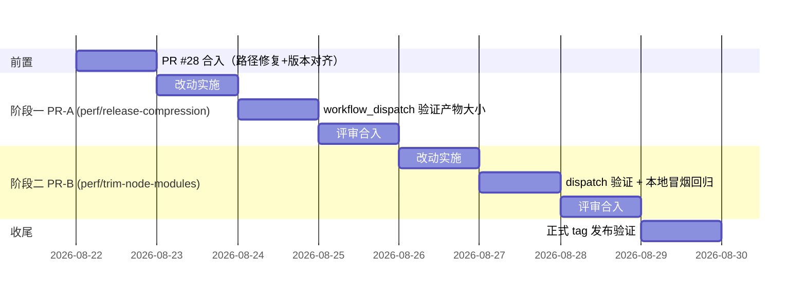

# 技术方案：Release 制品体积优化

> 状态：待评审
> 日期：2026-08-22
> 前置依赖：PR #28（fix/release-macos-bundle-path）先合入 main
> 目标读者：评审后按本方案实施

---

## 1. 现状分析

### 1.1 问题

v0.1.4 Release 资产中，除 Windows NSIS 外所有安装包都在 93~161MB，用户下载体验差。

| 资产 | 大小 | 压缩格式（实测确认） |
| --- | --- | --- |
| DSHWork_Windows_x64.exe (NSIS) | 49.0 MB | **LZMA（已最优）** |
| DSHWork_Windows_x64.msi | 93.3 MB | WiX 弱压缩（tauri-bundler 无配置项） |
| DSHWork_macOS_arm64.dmg | 94.9 MB | zlib（UDZO） |
| DSHWork_macOS_x64.dmg | 96.1 MB | zlib（UDZO） |
| DSHWork_Linux_amd64.deb | 96.8 MB | gzip（tauri-bundler 源码硬编码 flate2） |
| DSHWork_Linux_x86_64.rpm | 98.3 MB | gzip（RpmCompression 默认值） |
| DSHWork_Linux_amd64.AppImage | 160.8 MB | squashfs zstd（appimagetool 默认）+ 捆绑 GTK/webkit 库 |

**核心证据**：Windows NSIS 包（49MB）与其他包内容几乎相同，仅因压缩算法不同就小了一半。同 payload 换强压缩即可大幅缩小，且零功能风险。

### 1.2 体积构成（v0.1.4 macOS arm64 拆包实测，解压后共 405MB）

| 组件 | 大小 | 占比 | 可优化性 |
| --- | --- | --- | --- |
| dsh 的 node_modules | 270 MB | 67% | 部分：文件级裁剪 -82MB（实测）；依赖级不可行（见 1.3） |
| node 二进制 | 108 MB | 27% | **不可行**（见 1.4） |
| Rust 主程序 | 13 MB | 3% | 有限（strip 约 -2MB 压缩后，低性价比，不做） |
| pnpm + 图标 | 14 MB | 3% | 忽略 |

node_modules 内可裁剪冗余（实测）：

| 冗余内容 | 大小 | 说明 |
| --- | --- | --- |
| `*.map` sourcemap | 35.1 MB | 纯调试用，运行时永不读取 |
| node-pty 跨平台 prebuilds | 26 MB | 单包内含全平台二进制（win32-x64 12MB + win32-arm64 12MB + 其他 2MB） |
| README 等 `*.md` | ~10 MB | 保留 `LICENSE*` 即可 |
| `@deepseek-ai/dsh-sandbox-windows-acl` | 1 MB | Windows 专用，非 Windows 平台白带 |

### 1.3 依赖级裁剪为何不可行

node_modules 最大包为 `@opentelemetry` 28MB、`@mistralai` 27MB、`@aws-sdk`+`@smithy` 16MB、`@google` 14MB、`openai` 13MB、`@anthropic-ai` 7MB——是 dsh 内置的多模型 SDK 支持，砍掉即废功能，属上游（@deepseek-ai/dsh）的架构决策。本方案仅做文件级裁剪。

### 1.4 node 运行时精简实验结论（已实测，不采用）

官方二进制三平台大小：darwin-arm64 108MB / linux-x64 119MB / win-x64 83MB。

- macOS 版 strip 后 108→85MB（-21%），**但 xz 压缩后仅 22.4→20.2MB（省 2.2MB）**——符号表压缩率极高，strip 对安装包收益 ~2MB，不做。
- 替代运行时（bun ~100MB、deno 更大）不更小且有兼容风险；node 无官方精简版。
- 唯一根本解法是「不捆绑、首次启动下载」（安装包再 -22MB），属产品决策，**不在本方案范围**，列为后续可选项。

### 1.5 压缩格式实验数据（本方案收益依据，全部实测）

| 实验 | 结果 |
| --- | --- |
| v0.1.4 dmg payload 405MB，UDZO → ULMO(LZMA) 转换 | 94.9 → **68.5 MB**（-28%） |
| v0.1.4 deb 的 data.tar，gzip → `xz -9` 重打 | 96.2 → **56.9 MB**（-41%） |
| 裁掉 §1.2 表中冗余（405→323MB）后重建 ULMO dmg | **59.0 MB**（挂载验证通过） |
| `hdiutil create -format ULMO`（Gatekeeper 脚本重建路径） | 可用，产物挂载验证通过 |

兼容性：ULMO 需 macOS 10.15+（本项目 `minimumSystemVersion: 13.0` ✓）；AppImage xz 是最传统格式（AppImageLauncher 全面支持，zstd 才有兼容问题）；deb xz 为 dpkg 标准；rpm xz payload 需 rpm ≥4.10（2012 年后所有发行版满足）。

---

## 2. 当前架构分析

### 2.1 发布链路（main 现状）

```mermaid
flowchart TD
    A[main push] --> B[publish.yml<br/>release-plz 打 tag vX.Y.Z]
    B --> C[release.yml tag 触发]
    C --> D[build job 4 矩阵<br/>macOS arm64 / macOS x64 / Windows / Linux]
    D --> D1[fetch-dsh.sh<br/>pnpm 装 dsh + 清 musl/linux-arm64]
    D --> D2[fetch-runtime.sh<br/>node 二进制 + pnpm.cjs]
    D --> D3[tauri-action@v1 构建]
    D3 -->|"macOS：action 不上传"| D4[Stage + Gatekeeper 注入<br/>patch-dmg-gatekeeper.sh<br/>hdiutil create UDZO 重建]
    D4 --> D5[upload-artifact 手动上传]
    D3 -->|"Windows/Linux：action 直接上传"| D5
    D5 --> E[release job<br/>download-artifact 汇总]
    E --> F[rename 资产 + 生成下载表格]
    F --> G[softprops 正式发布]
    G --> H[upload-baidu-pan job<br/>按文件名下载资产传百度网盘]
```

### 2.2 各格式压缩机制与既有插入点（源码核实）

| 格式 | 机制 | 插入点 |
| --- | --- | --- |
| dmg | tauri-bundler 产 UDZO；**main 上 PR #23 已有后处理**：挂载→拷出→注入修复脚本→`hdiutil create -format UDZO` 重建 | `scripts/patch-dmg-gatekeeper.sh` 末行改 `-format ULMO` 即完成优化 |
| deb | tauri-bundler 硬编码 gzip（debian.rs 用 flate2），无配置 | 无既有插入点：Linux 需仿照 macOS 改为「action 不上传 + Stage 重打包 + 手动上传」 |
| rpm | `bundle.linux.rpm.compression` 官方配置项（stable schema 已含 xz） | `tauri.conf.json` 加配置，构建期生效 |
| AppImage | tauri-bundler 调 linuxdeploy（`--plugin gtk` 捆绑系统库，为固有地板约 +60MB）；压缩器由 appimagetool 内嵌 mksquashfs 决定 | **无优化空间**（实施时发现）：内嵌 mksquashfs 只编译了 zstd 且 zstd 已是默认，v0.1.4/v0.1.5 的 161MB 就是 zstd 产物；`LDAI_COMP=xz` 会直接失败（xz 未编译） |
| msi | WiX 弱压缩，无配置项 | 决策：保留不动（用户已确认），下载表格继续作为企业选项 |

### 2.3 约束与坑（已踩过/已核实）

1. **产物路径**：根 Cargo.toml 是 workspace，产物统一在仓库根 `target/<triple>/release/bundle/`（Linux 无 `--target` 时为 `target/release/bundle/`）。v0.1.5 曾因写成 `src-tauri/target/` 失败，PR #28（OPEN）修复中——**本方案基于 #28 合入后的 main**。
2. **dsh 缓存 key 不含脚本 hash**：现 key 仅 `dsh-{os}-{hash(dsh-version.txt)}`，阶段二改了 fetch-dsh.sh 后旧缓存会被命中导致清理不生效，必须把脚本 hash 纳入 key；且清理按 triple 差异化后，macOS 双 target 不能再共用按 OS 的缓存线。
3. **百度网盘流程**按资产文件名下载，本方案不改任何文件名，兼容；体积变小对其为纯收益。
4. **release.yml 仅 tag 触发**：新步骤合入 main 后到下个 tag 之间从未真正执行过（PR #23/#28 教训）。方案引入 workflow_dispatch 验收通道解决。
5. **tauri-action 上传时机**：action 内部上传 artifacts，自定义后处理插不进上传之前——macOS 已用「关闭 action 上传 + 手动上传」模式解决，Linux 复用同一模式。

---

## 3. 技术方案

总原则：**只动压缩与冗余文件，不动应用代码、不动资产文件名**。分两个阶段、两个独立 PR，均可在下个 tag 前任意时间合入。

### 阶段一：压缩格式升级（PR-A，零内容变更）

| # | 改动 | 文件 | 内容 |
| --- | --- | --- | --- |
| 1 | dmg 转 LZMA | `scripts/patch-dmg-gatekeeper.sh` | 重建镜像 `-format UDZO` → `-format ULMO`（一行 + 注释）。同时把头注释中「UDZO，与 create-dmg/Tauri 默认一致」更新为 ULMO 说明（需 macOS 10.15+，本项目 min 13.0） |
| 2 | deb 重打包 xz | `.github/workflows/release.yml` | Linux 仿照 macOS：`uploadWorkflowArtifacts: ${{ runner.os == 'Windows' }}`（仅 Windows 由 action 上传）；新增 Linux Stage 步骤：拷 `target/release/bundle/{deb,rpm,appimage}` 产物到 `staged/` → 对 `*.deb` 用 `fakeroot dpkg-deb -R/-b -Zxz -z9` 重打包（fakeroot 保证 tar 头 uid/gid 为 root:root；runner 上 `sudo apt-get install -y fakeroot` 预装）→ `upload-artifact`（name: `bundle-x86_64-unknown-linux-gnu`） |
| 3 | rpm xz | `src-tauri/tauri.conf.json` | `bundle` 下新增：`"linux": { "rpm": { "compression": { "type": "xz", "level": 9 } } }`，构建期生效，无需 CI 改动 |
| 4 | ~~AppImage xz~~ 不可行 | `.github/workflows/release.yml` | 实施结论：appimagetool continuous 内嵌 mksquashfs **只编译了 zstd 压缩器**（`LDAI_COMP=xz` 报 "Compressor xz is not supported"），zstd 已是默认值。AppImage 优化只剩阶段二内容裁剪 |
| 5 | 验收通道 | `.github/workflows/release.yml` | `on:` 增加 `workflow_dispatch:`；release job 加 `if: startsWith(github.ref, 'refs/tags/')`（dispatch 只构建+产出 artifacts 供检查，不发布 Release——避免 dispatch 模式下 GITHUB_REF_NAME 是分支名导致资产链接错乱） |

### 阶段二：node_modules 内容裁剪（PR-B，基于阶段一验证后）

| # | 改动 | 文件 | 内容 |
| --- | --- | --- | --- |
| 1 | 按平台裁剪 + 垃圾清理 | `scripts/fetch-dsh.sh` | ① 脚本改为接受目标 triple 参数；② 将现有 musl/linux-arm64 清理替换为「平台 token 统一裁剪」：目录名含非目标平台 token（`darwin-arm64` / `darwin-x64` / `linux-x64` / `linux-arm64` / `win32-x64` / `win32-arm64` 及 musl/freebsd/android 变体）则删除——覆盖 node-pty prebuilds、`@img/sharp-*`、`koffi-*` 等所有命名模式；③ 非 Windows 目标删除 `@deepseek-ai/dsh-sandbox-windows-acl`；④ 删除 `*.map` 与 `*.md`（保留 `LICENSE*`）；⑤ 保持「入口存在性检查」兜底 |
| 2 | 调用点与缓存 | `.github/workflows/release.yml` | ① `Fetch bundled dsh` 改为 `./scripts/fetch-dsh.sh ${{ matrix.triple }}`；② 缓存 key 改为 `dsh-${{ matrix.triple }}-${{ hashFiles('dsh-version.txt', 'scripts/fetch-dsh.sh') }}`（按 triple 分线 + 脚本 hash 失效，解决 §2.3-2） |
| 3 | 构建前冒烟 | `.github/workflows/release.yml` | fetch-runtime 之后新增 step：用捆绑的 node 直接跑 `resources/dsh/node_modules/@deepseek-ai/dsh/lib/bin.js --version`，三平台 bash 通用，验证裁剪未破坏 dsh 启动路径 |

**明确不做**（记录决策）：`*.ts`/`@types` 删除（用户确认仅无风险项）；node 二进制 strip（压缩后仅省 ~2MB）；MSI 处理（保留不动）；不捆绑 node（产品决策，另行讨论）。

---

## 4. 实施方案

### 4.1 分阶段计划



### 4.2 每阶段验收标准

**阶段一（PR-A）验收**：

1. PR 分支上手动 `workflow_dispatch` 触发 Release workflow，run 全绿；
2. 在 run 的 Artifacts 页面核对体积（对比 v0.1.4 基线）：

| 资产 | v0.1.4 基线 | 验收阈值 | 依据 |
| --- | --- | --- | --- |
| macOS arm64 dmg | 94.9 MB | **≤ 75 MB** | 同 payload 实测 68.5MB，留余量 |
| macOS x64 dmg | 96.1 MB | ≤ 76 MB | 同上 |
| Linux deb | 96.8 MB | **≤ 65 MB** | 实测 56.9MB，留余量 |
| Linux rpm | 98.3 MB | ≤ 70 MB | xz 压缩比参照 deb，留余量 |
| Linux AppImage | 160.8 MB | 不变（zstd 已是唯一/默认压缩器，见 §2.2） | — |
| Windows exe / msi | 49.0 / 93.3 MB | 不变 | 无改动 |

3. dispatch 模式下确认 **未创建任何 Release**（release job 被 if 挡住）。

**阶段二（PR-B）验收**：

1. dispatch 触发全绿，且新增冒烟 step 输出 dsh 版本号；
2. Artifacts 体积在阶段一基础上进一步下降：dmg ≤ 62MB、deb ≤ 55MB（依据：裁剪 -82MB 后 ULMO dmg 实测 59.0MB）；
3. **本地手动回归**（CI 无法替代）：下载 dispatch 构建的 dmg 安装 → 双击 dmg 内「首次打开修复.command」→ 启动 DSHWork → 在应用内执行一次 dsh 会话（覆盖 node_modules 运行时路径）；
4. 抽查安装包内容：`hdiutil attach` 后确认 node_modules 内无 `*.map`、node-pty 仅剩目标平台 prebuilds。

**正式发布验收（两阶段后）**：

1. 打正式 tag 前确认 `src-tauri/Cargo.toml` 版本已与根 crate 对齐（release-plz 不 bump publish=false crate，见 PR #28 注释）；
2. tag 触发 Release，核对发布资产体积与 dispatch 一致、下载表格链接有效、百度网盘 job 正常上传。

### 4.3 风险与回滚

| 风险 | 概率 | 缓解/回滚 |
| --- | --- | --- |
| LDAI_COMP=xz 后 AppImage 打包失败 | **已实际发生**：appimagetool 内嵌 mksquashfs 未编译 xz。处置：不设 LDAI_COMP（zstd 默认已是最优） |
| hdiutil create ULMO 产物在个别旧 macOS 打不开 | 极低（需 <10.15，本项目 min 13.0） | 回滚 = 脚本一行改回 UDZO |
| deb 重打包后 owner/权限异常 | 低（fakeroot 保证 root:root） | dispatch 产物本地 `dpkg-deb -c` 抽查；回滚 = Stage 步骤跳过重打包 |
| rpm xz 配置不被当前 tauri-cli 版本识别 | 低（stable schema 已含） | dispatch 构建若报 schema 错误则降级为 `{"type":"zstd","level":19}`（RHEL8+ 支持） |
| 裁剪误删运行时需要的文件 | 低（冒烟 step + 本地回归双保险） | 回滚 = fetch-dsh.sh 还原（缓存 key 含脚本 hash，还原后自动失效旧缓存） |
| CI 时长增加（xz 压缩慢：AppImage +3~5min、dmg +2~4min） | 确定，可接受 | 矩阵并行，不阻塞发布节奏 |
| 已知问题（不在本方案修复）：macOS x64 目标在 arm64 runner 上构建，pnpm 按宿主平台解析 `@img/sharp-darwin-arm64`，Intel 包内 sharp 原生模块平台不符 | — | 阶段二可选项：fetch-dsh.sh 传 `--config.os/--config.arch` 强制按目标平台安装（pnpm v10 支持）；默认不做，记录待 dsh 侧确认 sharp 是否必选功能 |

### 4.4 实施注意事项

1. 两个 PR 均从 **PR #28 合入后的 main** 切出，避免路径冲突与 rebase 返工；
2. 阶段一 release.yml 改动较多（Linux Stage 化），实施时 macOS Stage 步骤的注释与结构可直接对齐复用；
3. fetch-dsh.sh 平台 token 匹配用「目录名含 token」的 `-iname` 匹配（npm 生态平台包目录均为连字符命名），沿用现有 `find -prune -exec rm` 模式；
4. 不改任何资产文件名（rename 步骤、`releases/latest/download/<固定名>` 直链、百度网盘流程均依赖文件名稳定）。

---

## 5. 预期收益

| 资产 | v0.1.4 | 阶段一后 | 阶段二后（终态） | 终态幅度 |
| --- | --- | --- | --- | --- |
| macOS arm64 dmg | 94.9 MB | ~68.5 MB | **~59 MB**（实测依据） | **-38%** |
| macOS x64 dmg | 96.1 MB | ~70 MB | ~60 MB | -38% |
| Linux deb | 96.8 MB | ~57 MB | **~48 MB** | **-50%** |
| Linux rpm | 98.3 MB | ~62 MB | ~52 MB | -47% |
| Linux AppImage | 160.8 MB | 160.8 MB | ~130 MB | -19%（zstd 已是默认压缩器，仅剩内容裁剪；GTK 捆绑为固有地板） |
| Windows exe | 49.0 MB | 49.0 MB | ~46 MB | -6%（已接近极限） |
| Windows msi | 93.3 MB | 93.3 MB | 93.3 MB | 0（决策：保留） |

Release 总存储从 ~695MB 降至 ~458MB；百度网盘上传同步提速。

**后续可选方向**（均需独立决策，本方案不含）：不捆绑 node 首启下载（dmg 可至 ~35MB）；给 dsh 上游提多模型 SDK 拆包需求；启用 Tauri updater 恢复版本化资产时的压缩策略复用本方案。
